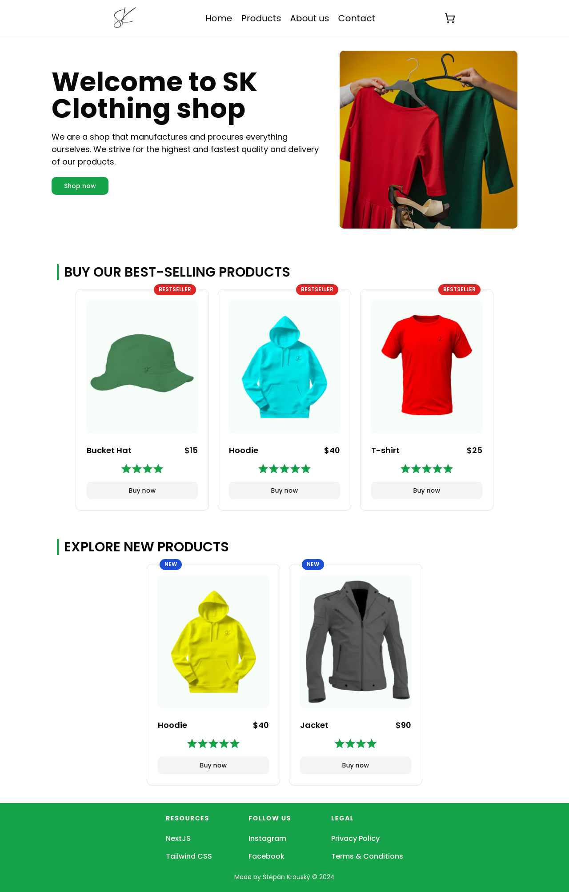

[DEMO](https://sk-clothing-shop.vercel.app)

# SK Clothing Shop



## Description

This is a simple project created without the need for a database, allowing anyone to clone it and build it immediately. It serves as a basic example of building an e-commerce website without relying on a backend database.

## Features

- Browse products
- Add items to cart
- Checkout process (optional: integrate with Stripe for payment processing)

## Technologies Used

- React
- Tailwind CSS
- Next.js
- Stripe (optional, for payment processing)

## How to run this project

1. (optional) If you plan to integrate Stripe for payment processing, you can create a .env file and set your Stripe secret key:

```bash
STRIPE_SECRET_KEY=your_stripe_secret_key_here
```

2. Install dependencies and run in development mode:

```bash
npm i && npm run dev
```

3. Open [http://localhost:3000](http://localhost:3000) in your browser to see the result.

## License

This project is licensed under the MIT License. However, please note that the images used in this project are from [Freepik](https://www.freepik.com) and may have their own licensing terms.

## Deployment

The demo of this project is deployed on [Vercel](https://vercel.com). You can access the demo [here](https://sk-clothing-shop.vercel.app).
